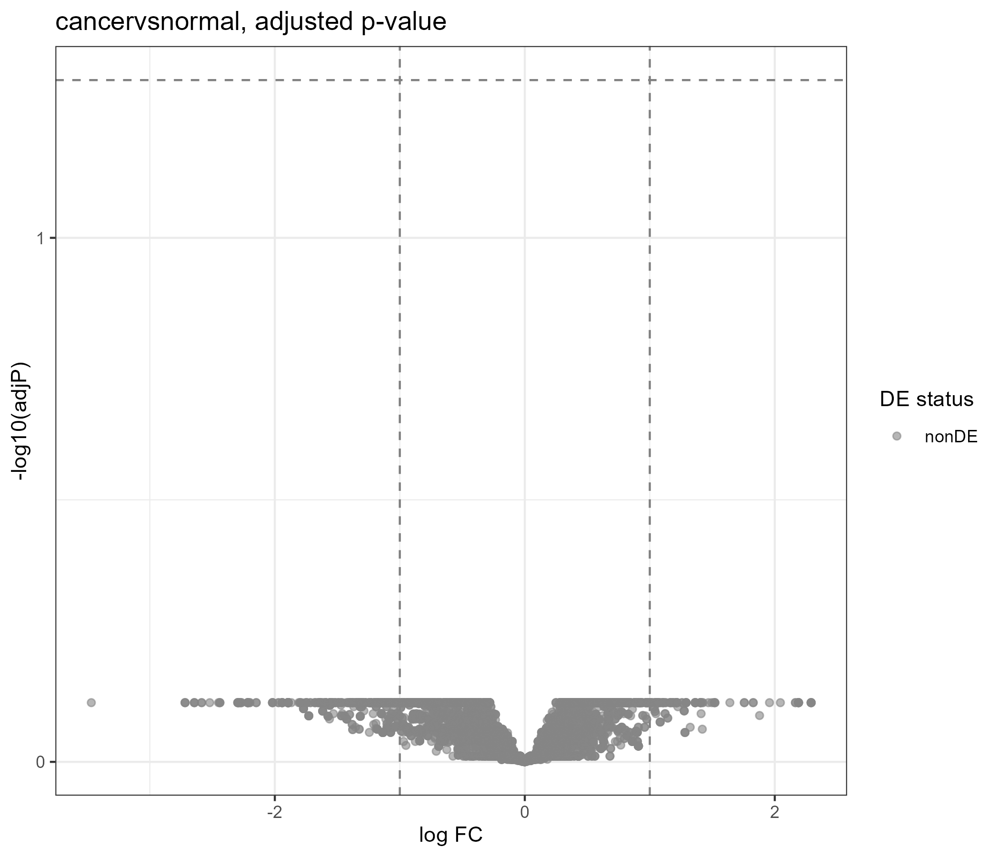
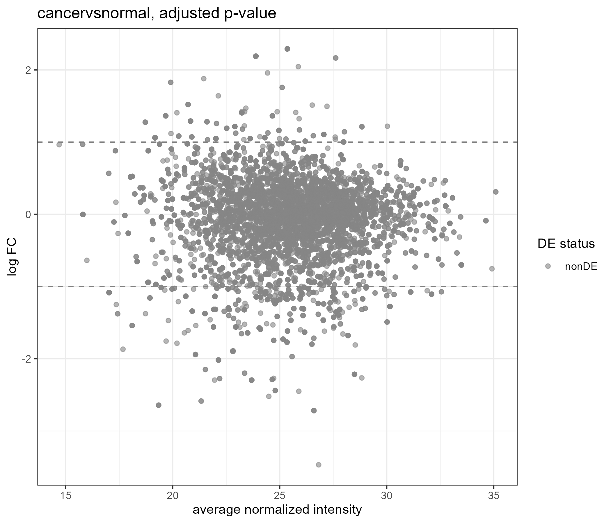
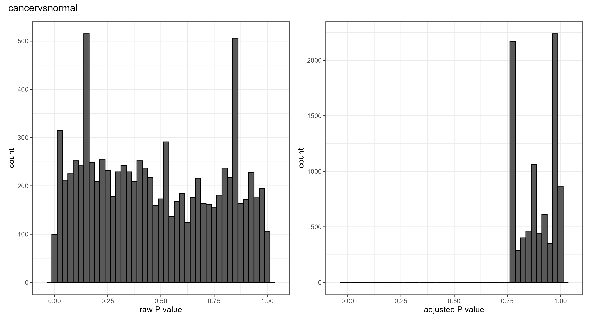

# Proteomics Differential Abundance Analysis Using proteoDA

This repository contains a differential abundance analysis workflow for mass spectrometry proteomics data. The statistical analysis was performed using the R package proteoDA, which implements the limma linear modeling framework to identify significantly altered proteins between cancer and normal sample groups.

## Project Workflow
The analysis pipeline covers the following steps:
1. Quality Control (QC): Assessing sample distributions and filtering noise.
2. Data Normalization: Standardizing intensity values across replicates.
3. Statistical Testing: Applying linear models via limma to calculate fold changes and adjusted p-values.
4. Visualization: Generating diagnostic and exploratory plots.

## Repository Structure
* `01_QC_report/` - Contains the sample quality control summary report (QC_report.pdf).
* `02_DA_results/` - Contains the statistical output tables including p-values and log fold changes (combined_results.csv) & plots (key statistical charts and diagnostic figures).

## Key Results

### Volcano and MD Plot

The volcano plot displays statistical significance (negative log10 p-value) versus magnitude of change (log2 fold change) to highlight significantly enriched or depleted proteins.

 

### P-value Histogram
 
The p-value distribution histogram evaluates the performance of the statistical model and the prevalence of true differential features.
